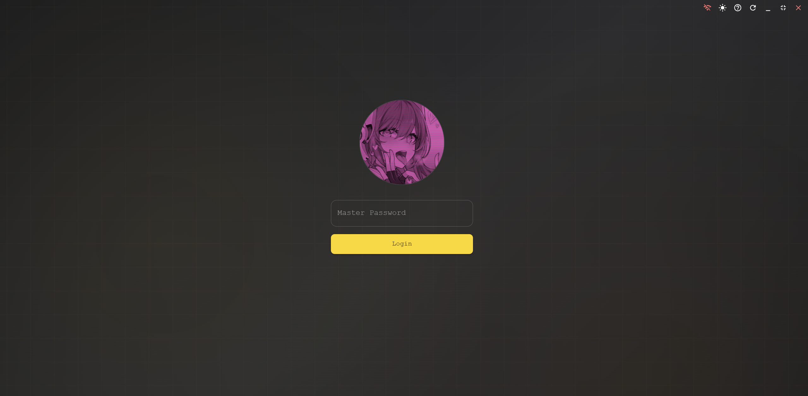
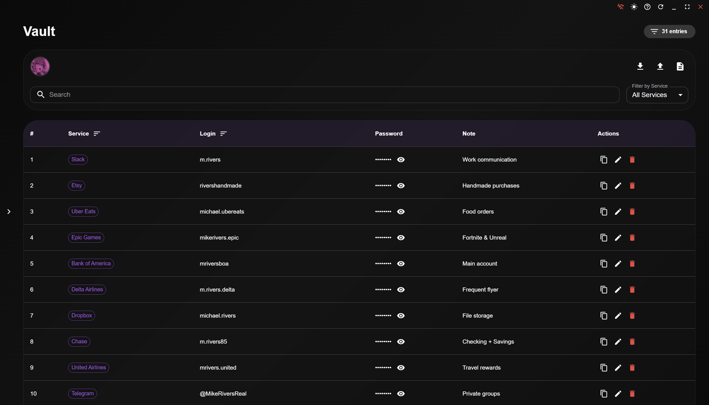

# 🔐 X-PASS — Secure Password Manager

[](LICENSE)
[](https://tauri.app)
[](https://www.rust-lang.org)
[](https://reactjs.org)

> **Enterprise-grade password manager with military-level security, offline-first architecture, and duress mode protection.**

<!-- 📸 INSERT SCREENSHOT HERE -->



---

## ✨ Features

### 🔒 **Military-Grade Security**
- **AES-256-GCM Encryption** — Bank-level encryption for all stored data
- **Argon2id Password Hashing** — Quantum-resistant key derivation
- **Zero-Knowledge Architecture** — Your master password never leaves your device
- **Offline-First Design** — No cloud, no tracking, no data leaks

### 🚨 **Advanced Security Features**
- **🔑 Two-Factor Authentication (TOTP)** — Compatible with Google Authenticator, Authy
- **📸 Failed Login Photo Capture** — Captures photos of unauthorized access attempts
- **🥷 Duress/Pseudo Mode** — Show fake vault under coercion (configurable panic password)
- **📊 Activity Logging** — Track all vault access with detailed analytics
- **🔄 Encrypted Backups** — Export/import with password-protected encryption

### 🎨 **User Experience**
- **10 Premium Themes** — Dark, Light, Cyberpunk, Dracula, Ocean, and more
- **13 Languages** — English, Russian, Spanish, German, French, Arabic, Hindi, etc.
- **Custom Window Controls** — Frameless design with smooth animations
- **Smooth Scrolling** — Polished UI with Framer Motion animations

<!-- 🎥 INSERT DEMO GIF HERE -->


---

## 🚀 Quick Start

### Prerequisites
- **Node.js** 18+ ([Download](https://nodejs.org))
- **Rust** 1.70+ ([Install](https://rustup.rs))
- **Tauri CLI** ([Setup Guide](https://tauri.app/start/prerequisites))

### Installation

```bash
# Clone the repository
git clone https://github.com/ar3love/x-pass.git
cd x-pass

# Install dependencies
npm install

# Run in development mode
npm run tauri dev

# Build for production
npm run tauri build
```

### First Launch
1. Create your **master password** (min. 8 characters)
2. Enable **2FA** (recommended) — Scan QR code with authenticator app
3. Start adding passwords to your vault!

---

## 📦 Download Pre-Built Binaries

| Platform | Download |
|----------|----------|
| 🪟 **Windows** | [x-pass_0.1.0_x64.msi](https://github.com/arelove/x-pass/releases) |
| 🍎 **macOS** | [x-pass_0.1.0_aarch64.dmg](https://github.com/arelove/x-pass/releases) |
| 🐧 **Linux** | [x-pass_0.1.0_amd64.deb](https://github.com/arelove/x-pass/releases) |

---

## 🔐 Security Architecture

```
┌─────────────────────────────────────────────────┐
│          Your Master Password (Argon2id)        │
└─────────────────┬───────────────────────────────┘
                  │ Derives 256-bit key
                  ▼
┌─────────────────────────────────────────────────┐
│       AES-256-GCM Encrypted SQLite Database     │
│  ┌──────────────────────────────────────────┐   │
│  │  Encrypted Entry 1: {site, user, pass}   │   │
│  │  Encrypted Entry 2: {site, user, pass}   │   │
│  │  Encrypted Entry N: {site, user, pass}   │   │
│  └──────────────────────────────────────────┘   │
└─────────────────────────────────────────────────┘
         │                              │
         │ Pseudo Mode                  │ Real Vault
         ▼                              ▼
    Fake Vault (Duress)          Real Passwords
```

### Key Security Features
- **No Master Password Storage** — Only a hash is stored (Argon2id with salt)
- **Per-Entry Encryption** — Each password is individually encrypted
- **Memory Wiping** — Sensitive data cleared from RAM after use
- **No Network Calls** — All operations happen locally (optional offline mode)

<!-- 📸 INSERT SECURITY DIAGRAM HERE -->


---

## 🛡️ Duress/Pseudo Mode

**Scenario:** Someone forces you to unlock your vault under threat.

**Solution:** Set up a **panic password** that shows a fake vault with decoy data.

### How It Works
1. Go to **Settings → Security → Pseudo Mode**
2. Create a secondary password
3. Choose action: **Show Fake Vault** or **Wipe Real Data**
4. Generate fake entries automatically

```typescript
// Real password → Real vault
login("my-real-password") // ✅ Accesses actual passwords

// Panic password → Decoy vault
login("panic-123") // ⚠️ Shows fake LinkedIn/Gmail entries
```

<!-- 🎥 INSERT PSEUDO MODE DEMO HERE -->


---

## 🌍 Supported Languages

| Language | Code | Status |
|----------|------|--------|
| 🇬🇧 English | `en` | ✅ Complete |
| 🇷🇺 Russian | `ru` | ✅ Complete |
| 🇪🇸 Spanish | `es` | ✅ Complete |
| 🇩🇪 German | `de` | ✅ Complete |
| 🇫🇷 French | `fr` | ✅ Complete |
| 🇸🇦 Arabic | `ar` | ✅ Complete |
| 🇮🇳 Hindi | `hi` | ✅ Complete |
| 🇮🇩 Indonesian | `id` | ✅ Complete |
| 🇮🇹 Italian | `it` | ✅ Complete |
| 🇯🇵 Japanese | `ja` | ✅ Complete |
| 🇰🇷 Korean | `ko` | ✅ Complete |
| 🇧🇷 Portuguese | `pt` | ✅ Complete |
| 🇨🇳 Chinese | `zh` | ✅ Complete |

Want to add your language? [Contribute here!](CONTRIBUTING.md)

---

## 🎨 Themes

| Theme | Preview |
|-------|---------|
| 🌙 **Dark** | Default dark mode with blue accents |
| ☀️ **Light** | Clean minimalist light theme |
| 💜 **Cyberpunk** | Neon purple with glitch effects |
| 🧛 **Dracula** | Popular purple/pink dark theme |
| 🌊 **Ocean** | Calming blue gradient |
| 🏜️ **Sand** | Warm beige desert theme |
| 🌅 **Sunset** | Orange/purple gradient |
| ☢️ **Toxic** | Radioactive green |
| 🎆 **Neon** | Bright cyan/magenta |
| 🌈 **Fallout** | Post-apocalyptic amber |

<!-- 📸 INSERT THEME SHOWCASE HERE -->


---

## 📊 Project Structure

```
x-pass/
├── src/                    # React frontend
│   ├── components/         # UI components
│   ├── context/           # React contexts (Auth, Theme, Pseudo)
│   ├── pages/             # Main pages (Login, Vault, Settings)
│   └── assets/            # Translations, images
│
├── src-tauri/             # Rust backend
│   ├── src/
│   │   ├── password_manager.rs   # Core vault logic
│   │   ├── otp.rs                # TOTP 2FA
│   │   ├── pseudo_mode.rs        # Duress mode
│   │   ├── activity_logger.rs    # Security logging
│   │   ├── backup.rs             # Encrypted export/import
│   │   └── lib.rs                # Main entry point
│   └── Cargo.toml         # Rust dependencies
│
├── docs/                  # Documentation
│   ├── images/           # Screenshots & diagrams
│   └── architecture.md   # Technical deep dive
│
└── README.md             # You are here!
```

---

## 🧪 Development


### Build for Specific Platform
```bash
# Windows
npm run tauri build -- --target x86_64-pc-windows-msvc

# macOS (Intel)
npm run tauri build -- --target x86_64-apple-darwin

# macOS (Apple Silicon)
npm run tauri build -- --target aarch64-apple-darwin

# Linux
npm run tauri build -- --target x86_64-unknown-linux-gnu
```

### Debug Mode
```bash
# Enable verbose logging
RUST_LOG=debug npm run tauri dev
```

---

## 🤝 Contributing

We welcome contributions! Please see [CONTRIBUTING.md](CONTRIBUTING.md) for guidelines.

### Ways to Contribute
- 🐛 **Report bugs** — [Open an issue](https://github.com/arelove/x-pass/issues)
- 🌍 **Translate** — Add new language files
- 🎨 **Design** — Create new themes
- 💻 **Code** — Fix bugs or add features
- 📝 **Documentation** — Improve guides

---

## 📜 License

This project is licensed under **GPL-3.0** with additional commercial restrictions.

- ✅ **Free for personal use, education, and open-source projects**
- ❌ **Commercial entities (revenue > $1M/year) require a separate license**
- 📧 **Contact:** [ar3love@outlook.com] for commercial licensing

See [LICENSE](LICENSE) for full terms.

---

## 🙏 Acknowledgments

Built with these amazing technologies:
- [Tauri](https://tauri.app) — Rust-powered desktop framework
- [React](https://reactjs.org) — UI library
- [Material-UI](https://mui.com) — Component library
- [Argon2](https://github.com/P-H-C/phc-winner-argon2) — Password hashing
- [AES-GCM](https://en.wikipedia.org/wiki/Galois/Counter_Mode) — Encryption standard

---

## 📞 Support

- 🐛 **Bug Reports:** [GitHub Issues](https://github.com/arelove/x-pass/issues)
- 💬 **Discussions:** [GitHub Discussions](https://github.com/arelove/x-pass/discussions)
- 📧 **Email:** [ar3love@outlook.com]
- 🌐 **Website:** [Coming Soon]

---

<p align="center">
  <strong>Made with ❤️ by <a href="https://github.com/arelove">arelove</a></strong>
</p>

<p align="center">
  ⭐ <strong>Star this repo if you find it useful!</strong> ⭐
</p>
